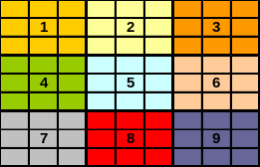

# Enunciado

El Sudoku es un juego que existe desde hace unos años, pero recientemente se ha
vuelto popular en todo el mundo. La idea básica del juego es usar la lógica para
resolver un problema simple, sin necesidad de poseer habilidades matemáticas para
jugarlo. 

El Sudoku esta compuesto por un tablero de 9 x 9, en el que las casillas se
encuentran agrupadas en 9 zonas.  Cada  zona contiene 9 casillas, como se muestra
a continuación:

La idea del juego es partiendo de algunos números ya dispuestos, colocar en las
casillas restantes del tablero un número del 1 al 9, siguiendo las siguientes reglas:

1. La columna del tablero donde se va a colocar el número no puede contener el
mismo número.
2. La fila del tablero donde se va a colocar el número no puede contener el
mismo número.
3. La zona no puede tener números repetidos.
4. Cada Sudoku tiene una única solución.

A cada zona se le asignara un número, por claridad y para que sea fácilmente
identificable.

Se necesita desarrollar una aplicación que permita jugar Sudoku. La aplicación
debe permitir:

1. Cargar un nuevo juego a partir de un archivo de propiedades que contiene
los números de la solución. Se deben colocar al azar en cada zona tres números
para que el usuario pueda comenzar a jugar.
2. Permitir al usuario ingresar (y modificar) los números en las casillas del
tablero que no tienen un número asignado previamente por la aplicación. 
3. Verificar, en cualquier momento los números ingresados por el usuario. Para
que la aplicación sea más amigable, se definió un estándar de colores para
indicar que el usuario comprenda cuales son sus errores o sepa cuando terminó.

     La casilla se encuentra
    desocupada.  
     El número de la casilla se encuentra
    en una zona, fila o columna donde no se cumplen las reglas.  
     El número de la casilla es correcto
    (Solo deberá mostrarse cuando el juego este correcto y completo, junto con un
    mensaje informativo donde se le indique al usuario que terminó el juego)  
     La casilla tiene un número
    jugado por el usuario que esta pendiente por validarse cuando se llenen todas
    las casillas del tablero.  

4. Mostrar la solución del Sudoku que se está jugando. La utilización de tal
opción implica la finalización del juego y  reemplazar en el tablero todo lo
que haya hecho el usuario hasta el momento con el fin de mostrar solución.

# Interfaz

